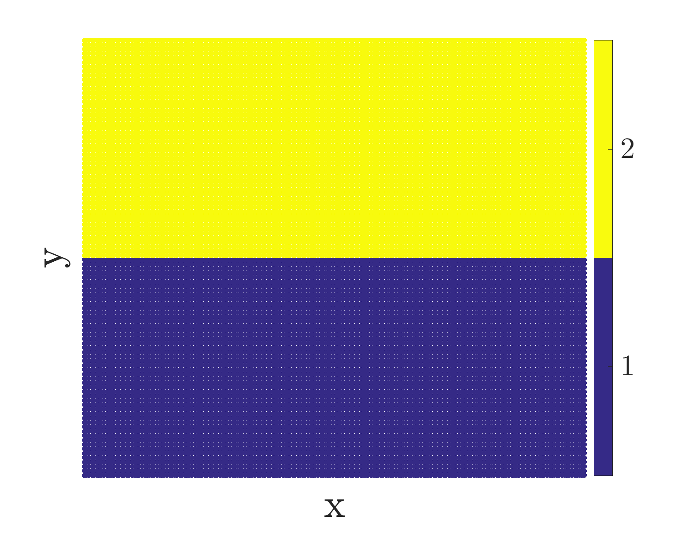

# Color map of clusters division

```matlab
plot_clusters_color_map(mesh_x, mesh_y, idx, destination)
```

This function plots a color map for clusters division.


## Example plotting with function `plot_clusters_color_map()`

```matlab
clc, clear, close all

np_x = 100; np_y = 200;
mesh_x = [];
mesh_y = [];

vec_y = 0.01*(1:1:np_y);

for i = 1:1:np_x

    vec_x = 0.01*ones([np_y, 1]).*i;
    mesh_x = [mesh_x; vec_x];
    mesh_y = [mesh_y; vec_y'];

end

idx = [ones([np_x*np_y/2,1]); 2*ones([np_x*np_y/2,1])];
destination = 'example_';

plot_clusters_color_map(mesh_y, mesh_x, idx, destination)
```



## Plotting the colorbar only (with clusters division)

This is a code fragment that will plot only the colorbar for the existing Matlab figure.

```matlab
%% User input ----
% Specify number of clusters:
k = 16;
% Specify fontsize for the colorbar:
fontsize_colorbar = 12;

% Run this rest of the code for your existing figure:
cluster_range = 1:1:k;
colormap(parula(k));
cb = colorbar;
cb.FontSize = fontsize_colorbar;
cb.FontName = 'cmr10';
set(cb, 'ticks', (1+0.5*(k-1)/k):((k-1)/k):(k - 0.5*(k-1)/k), 'ticklabels', cluster_range);
```
