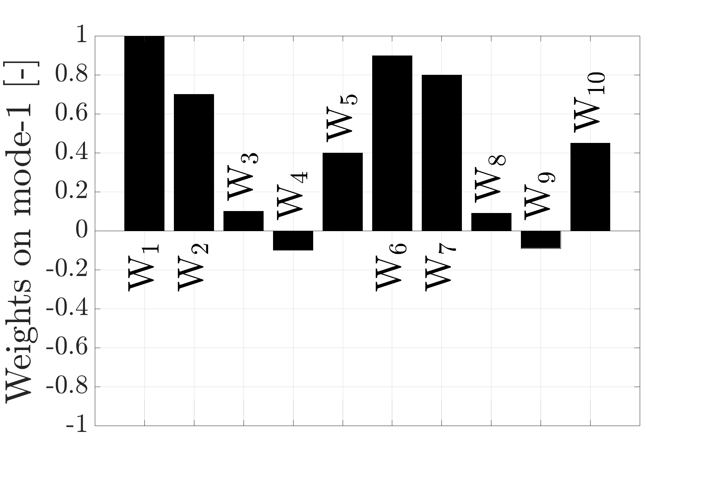
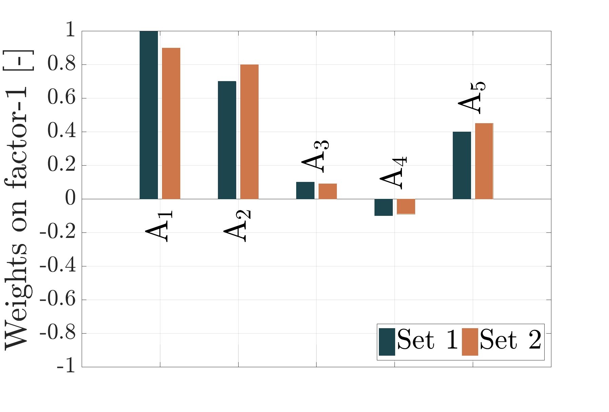

# Bar plot of eigenvector weights

```matlab
plot_eigenvector_weights_bar_plot(A, n_mode_sets, n_request_eigvecs, mode_name, annotations, labels, colors, destination, prefix)
```

This function plots annotated bar plots from **normalized** eigenvector weights.

## Example quick plotting

For quick plotting of just one set call the function with only `A`, `n_mode_sets=1` and `n_request_eigvecs`:

```matlab
plot_eigenvector_weights_bar_plot(A, 1, n_request_eigvecs)
```

```matlab
A = [1; 0.7; 0.1; -0.1; 0.4;
    0.9; 0.8; 0.09; -0.09; 0.45];
n_request_eigvecs = 1;

plot_eigenvector_weights_bar_plot(A, 1, n_request_eigvecs);
```



## Example plotting

```matlab
data_aliases = {'Set 1', 'Set 2'};
variables = {'$\rm{A_1}$', '$\rm{A_2}$', '$\rm{A_3}$', '$\rm{A_4}$', '$\rm{A_5}$'};
colors = [
[29 69 77]
[206 119 74]
]./256;
A = [1; 0.7; 0.1; -0.1; 0.4;
    0.9; 0.8; 0.09; -0.09; 0.45];

plot_eigenvector_weights_bar_plot(A, 2, 1, 'factor', variables, data_aliases, colors, 'example', '');
```


