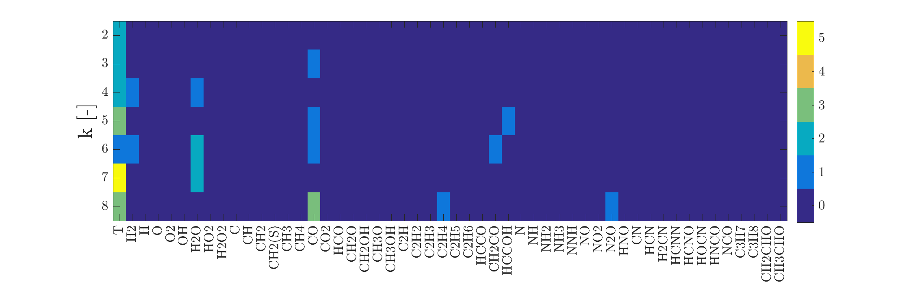
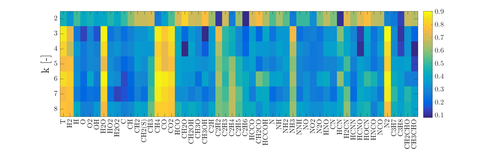

# Plot imshow of a matrix

Functions for plotting imshow of a matrix.

## Discrete values

```matlab
plot_discrete_imshow(discrete_matrix, annotations, k_list, title_text, destination)
```



## Continuous values

```matlab
plot_continuous_imshow(continuous_matrix, annotations, k_list, title_text, destination)
```




