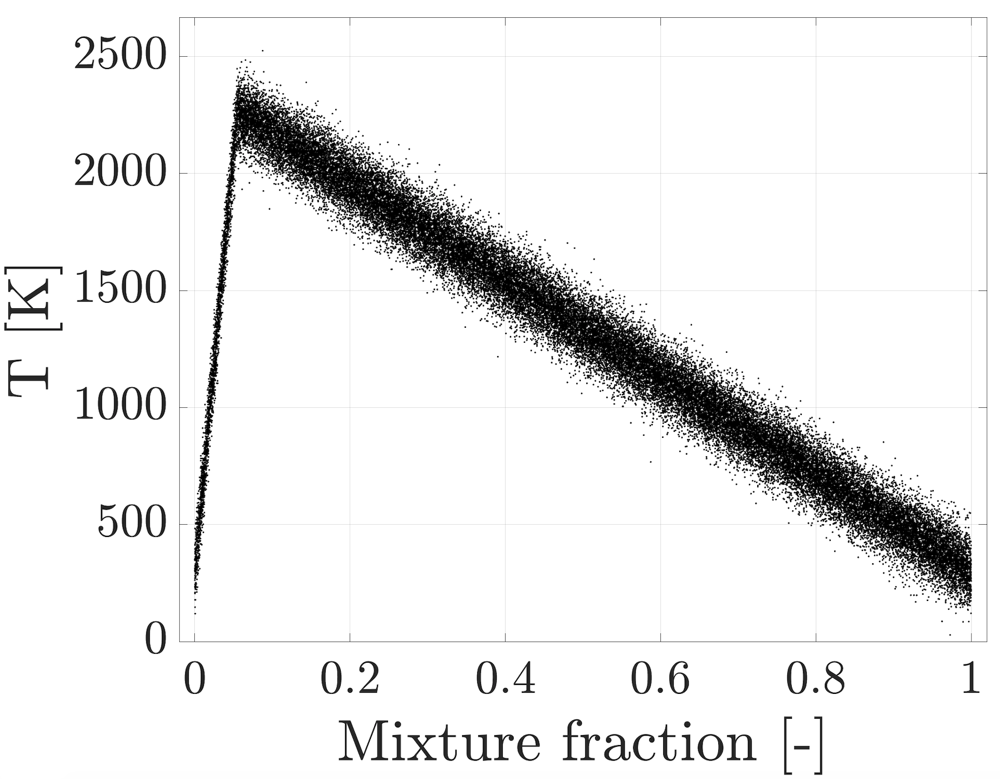
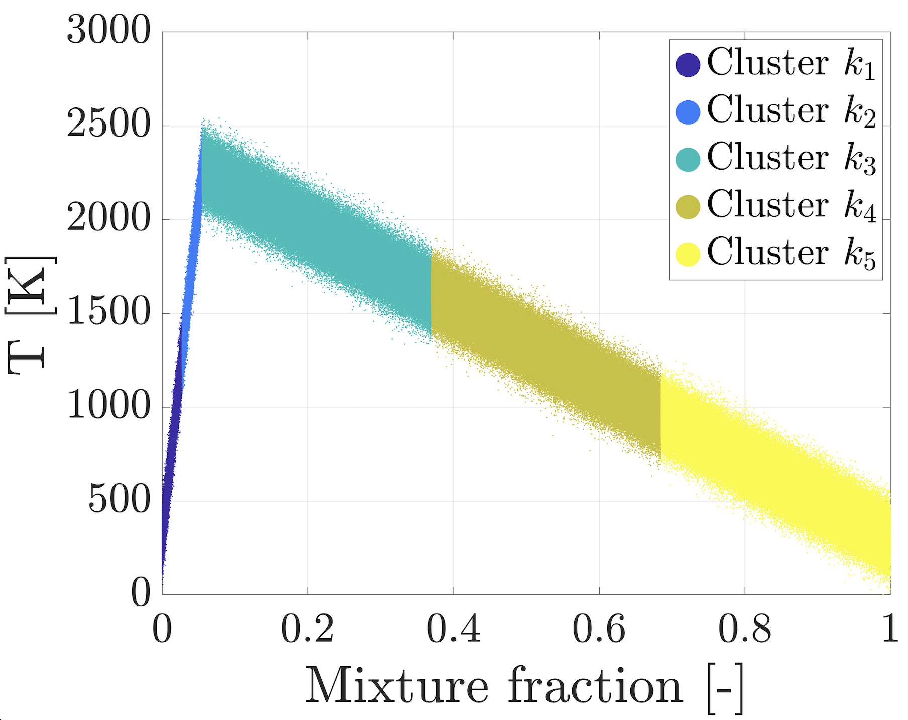
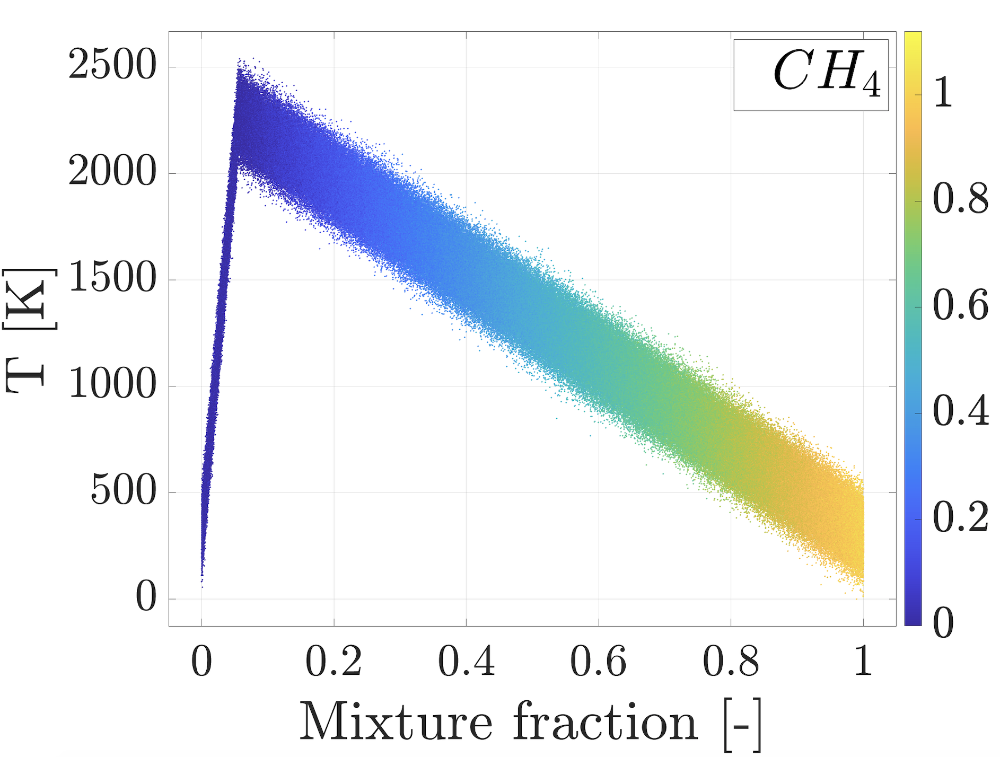

# Plot mixture fraction

## Plot mixture fraction vs. a variable of choice

```matlab
plot_mixture_fraction_vs_variable(var, Z, var_name, y_label_text, destination)
```



## Plot mixture fraction divided to clusters

```matlab
plot_mixture_fraction_divided_to_clusters(T, Z, idx, np, y_label_text, destination)
```



## Plot mixture fraction vs. a variable colored with another variable

```matlab
plot_mixture_fraction_vs_variable_colored_manifold(Z, var, var_color, var_name, y_label_text, legend_text, destination)
```


