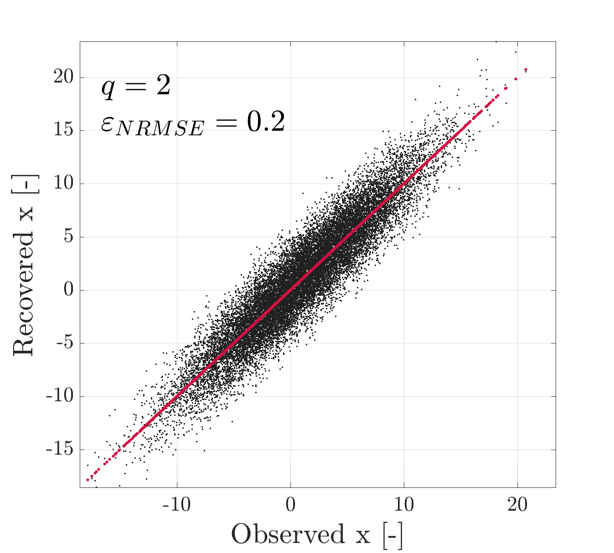

# Parity plot

```matlab
plot_parity(original, reconstruction, var_name, var_unit, text_ann, destination)
```

This function plots a parity plot between an original variable and its reconstruction.


## Example plotting with function `plot_parity()`

```matlab
clc, clear, close all

original = normrnd(1, 5, [20000, 1]);
reconstruction = original + normrnd(0.1, 2, [20000, 1]);
var_name = 'x';
var_unit = '-';
text_ann = {['$q = 2$'], ['$\varepsilon_{NRMSE} = 0.2$']};
destination = 'example_';

plot_parity(original, reconstruction, var_name, var_unit, text_ann, destination)
```


