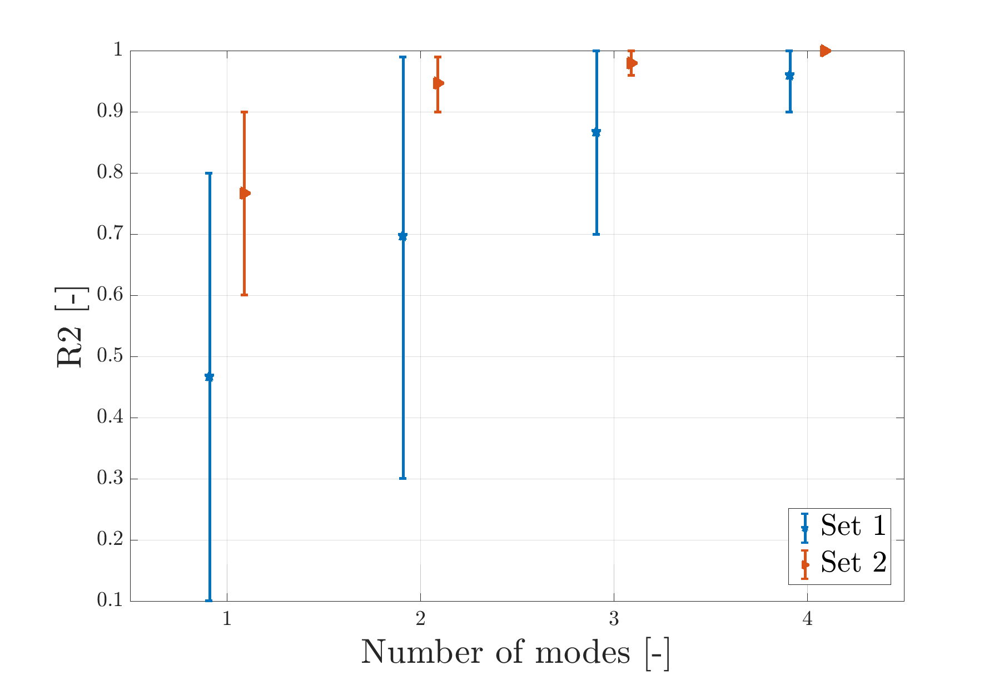

# Error bar plot of quality of reconstruction measures

```matlab
plot_qor_measure_error_bar_plot(qor_name, qor_matrix, n_subs, log_scale, y_limits, y_ticks, labels, markers, colors, legend_loc, destination)
```

This function plots error bar graphs for the quality of reconstruction (QoR) measure that could for instance be:

- **R2** - coefficient of determination

- **RMSE** - root mean squared error

## Example plotting with function `plot_qor_measure_error_bar_plot()`

```matlab
clc, clear all, close all
markers = {'p', '>'};
colors = [
[0 0.4470 0.7410]
[0.8500 0.3250 0.0980]];
A_qor = [0.1 0.5 0.8 ;
        0.3 0.8 0.99 ;
        0.7 0.9 1 ;
        0.9 0.98 1;
        0.6 0.8 0.9 ;
        0.9 0.95 0.99 ;
        0.98 0.96 1
        1 1 1];

plot_qor_measure_error_bar_plot('R2', A_qor, 2, 0, {'Set 1', 'Set 2'}, markers, colors, 'example_qor_')
```


