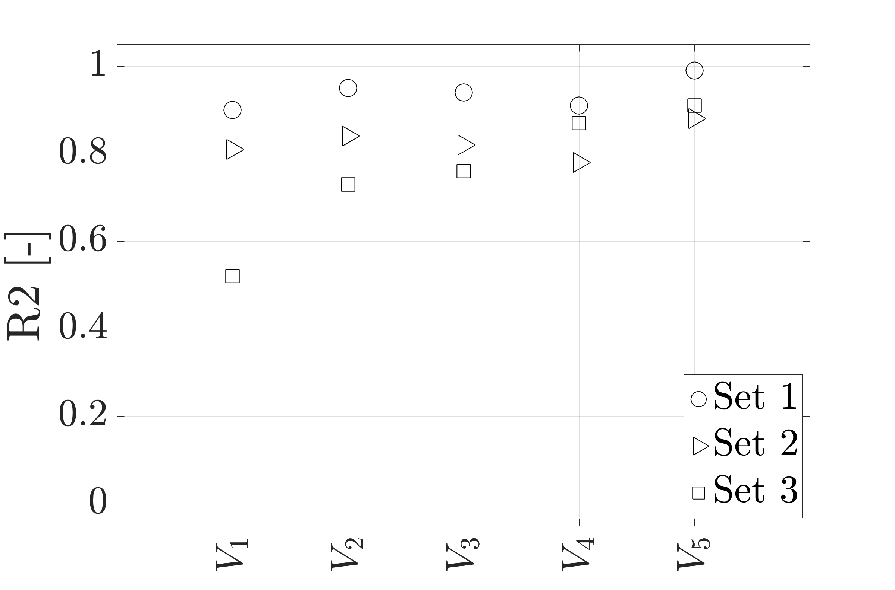

# Scatter plot of values vs. a variable

```matlab
plot_value_per_variable(qor_name, qor_matrix, ylims, annotations, labels, markers, legend_loc, destination)
```

This function plots a scatter plot of a value (y-axis) for variables (x-axis).

It could be used for plotting the quality of reconstruction (QoR) measure that could for instance be:

- **R2** - coefficient of determination

- **RMSE** - root mean squared error

## Example plotting with function `plot_value_per_variable()`

```matlab
clc, clear, close all
qor_name = 'R2';
qor_matrix = [0.9 0.95 0.94 0.91 0.99 ; 0.81 0.84 0.82 0.78 0.88 ; 0.52 0.73 0.76 0.87 0.91];
ylims = [-0.05, 1.05];
annotations = {'$V_1$', '$V_2$', '$V_3$', '$V_4$', '$V_5$'};
labels = {'Set 1', 'Set 2', 'Set 3'};
markers = {'o', '>', 's'};
legend_loc = 'southeast';
destination = '';

plot_value_per_variable(qor_name, qor_matrix, ylims, annotations, labels, markers, legend_loc, destination)
```

