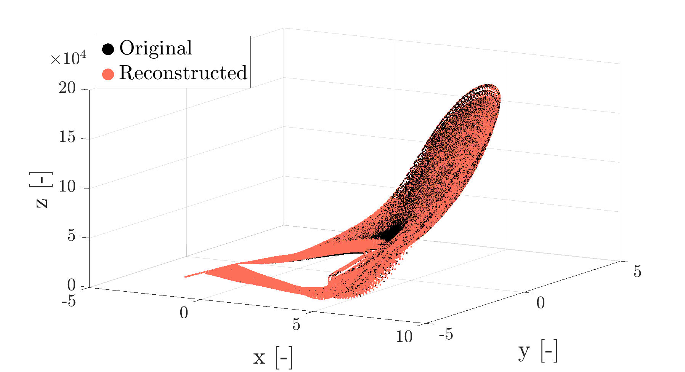

# Visualise how well variable(s) is(are) reconstructed

## Plot 3D variable reconstruction

`plot_3d_variable_reconstruction(x, y, z_original, z_reconstructed, x_name, y_name, z_name, camera_view, destination)`

### Quick plotting

`plot_3d_variable_reconstruction(x, y, z_original, z_reconstructed, '', '', '', [], '')`

### Example plotting with `plot_3d_variable_reconstruction()`

